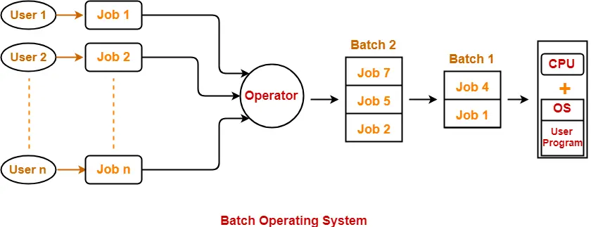

# OPERATING SYSTEM ?

System Software that acts as an Intermediary b/w user and h/w.   
Provides an environment where users can execute programs by hiding complexity

---
**WHAT IF NO OS?**  
Bulky Complex App,  
Resource exploitation by 1 App,  
No Memory Protection

---
**FUNCTIONS OF OS**  
Provides Interface,  
Arbitration,  
Abstraction,  
Isolation & Protection

---
**GOALS OF OS**  
Maximum CPU Utilization  
No Process Starvation  
High Priority Job Execution

---
# 
 TYPES

1. BATCH OPERATING SYSTEM

2. MULTIPROGRAMMING OS  
Multiple programs are loaded into memory and the CPU switches between them to maximize CPU usage
3. MUTITASKING OS  
Allows a single user to run multiple tasks at the same time.
4. MUTLIPROCESSING  
Uses multiple CPUs (or cores) to run multiple processes in parallel. 

| Feature          | **Multiprogramming**        | **Multitasking**                | **Multiprocessing**                 |
| ---------------- | --------------------------- | ------------------------------- | ----------------------------------- |
| CPUs             | 1                           | 1                               | More than 1                         |
| Execution        | One at a time (others wait) | Multiple tasks (fast switching) | True parallel execution             |
| Example OS       | Early UNIX, Batch systems   | Windows, Linux                  | Windows, macOS, Linux on multi-core |

5. REAL TIME OS  
An RTOS responds to inputs or events within a strict time limit (called deadlines).  
A Hard Real-Time System guarantees that critical tasks are completed within a strict deadline — if missed, it can cause catastrophic failure.  
A Soft Real-Time System tries to meet deadlines, but occasional delays are acceptable. It may degrade performance but won’t cause serious damage.

1. DISTRIBUTED