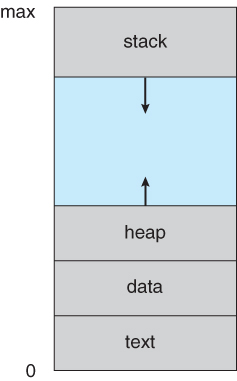
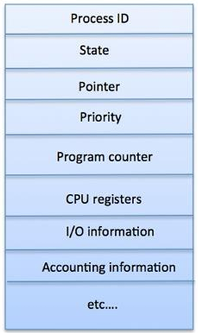

# PROCESS MANAGEMENT

PROGRAM ?  
Set of instructions stored in secondary memory

PROCESS ?  
A Program when loads in Main memory and a PCB is created, An active entity

STORAGE IN MEMORY ?  
- Stack : Temporary data - Parameters, return value...
- Heap : Dynamic allocated memory
- Data : Global ,Static data/variables
- Text : Code 

---
## PCB ?  
Also called process descriptor, Data structure used to store all the information about a process.  
PCB is identified by an integer process ID (PID)

