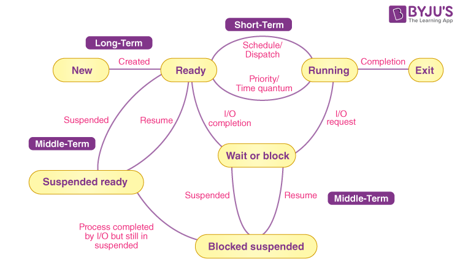
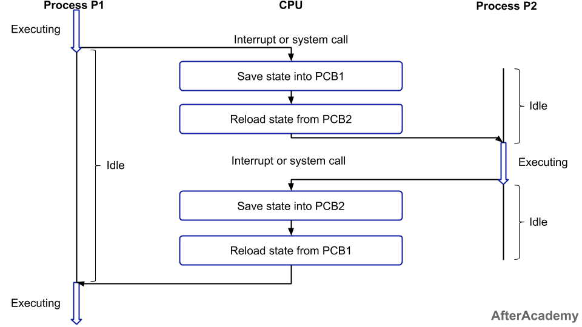

# PROCESS STATE

| State                 | Technical Description                                                                                  |
| --------------------- | ------------------------------------------------------------------------------------------------------ |
| **New**               | The process is being created.     |
| **Ready**             | The process is in memory and waiting for the CPU to be assigned by the scheduler.                      |
| **Running**           | The process is currently executing on the CPU. Only one process per core can be in this state.         |
| **Waiting / Blocked** | The process cannot continue without an external event (e.g., I/O completion, semaphore release).       |
| **Terminated / Exit** | The process has completed execution or has been forcibly stopped due to an error or user intervention. |

---

## STATE TRANSITION
| Transition               | Cause                                                   | Description                                                       |
| ------------------------ | ------------------------------------------------------- | ----------------------------------------------------------------- |
| **New → Ready**          | Process is created; admitted by OS                      | OS allocates resources and places the process in the ready queue. |
| **Ready → Running**      | CPU scheduler selects the process                       | **Dispatcher** allocates CPU.                                         |
| **Running → Waiting**    | I/O request, semaphore wait, sleep() call               | Process voluntarily gives up the CPU until event occurs.          |
| **Waiting → Ready**      | I/O completes, semaphore signal, wakeup() call          | Process becomes eligible to run again.                            |
| **Running → Ready**      | Time quantum expires or higher-priority process arrives | Preemption occurs in preemptive scheduling (e.g., Round Robin).   |
| **Running → Terminated** | Process finishes or encounters an error                 | OS deallocates resources and updates PCB.                         |

## CONTEXT SWITCHING

When Does Context Switching Happen?
 1. When a high-priority process comes to a ready state (i.e. 
with higher priority than the running process)
 2. An Interrupt occurs
 3. Preemptive CPU scheduling is used.