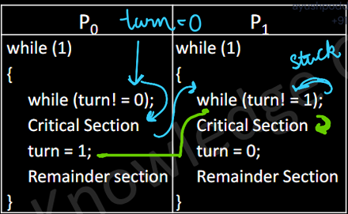

# RACE CONDITION ? 
- A Race Condition occurs when two or more 
processes or threads access shared data 
simultaneously,  
and the final outcome depends 
on the order of execution. 
- If we change the order of execution of processes 
Output may vary 

---
### PROCESS STRUCTURE

1. Initial Section : Process acessing pvt resources
2. Entry Section : Part of code where process requests for permission to enter CS
3. CRITICAL SECTION ?    
Part of a program, where a shared resource  
is accessed & modified by multiple processes or threads.
4. Exit Section : Porcess exits CS
5. Remainder Section : Remaining code

---
### CRITERIA TO BE SOL OF CS
1. MUTUAL EXCLUSION  
Only one process/thread can be inside the 
critical section at any given time 
2. PROGRESS (Compulsion) - 
If no process is inside the critical section, and 
there is a process requesting access,  
the decision about which process should go 
next should be made by one in remainder section
3. BOUNDED WAITING -  
There must be a limit on how many times 
a processe can access the CS to avoid others starvation 

---
### CSP SOLUTIONS

1. Using Boolean Variable

2. Boolean Array Flag

3. Peterson's Solution

3.1 