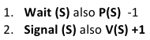
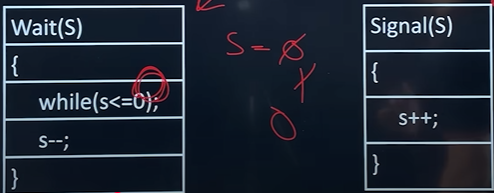
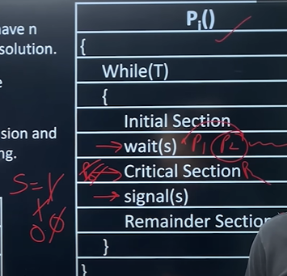

# SEMAPHORES
A Synchronization tool, used to control access to a shared resource by multiple processes,  
in a concurrent system.

It helps prevent race conditions and ensures mutual exclusion.  

TYPES : 
1. Binary : 0 or 1, also called Mutex
2. Counting : 0 or more.., to manage limited instance

---
Two Atomis Opertaions  

---

Initialize SEMAPHORE with 1
1. Wait -> S=0
2. Signal -> S=1
   

---
### Common Problems with Semaphores
- Busy Waiting:  
CPU cycles are wasted in while-loop (can be solved with blocking).
- Deadlock:  
If processes hold one semaphore and wait on another.
- Starvation:  
A process may never get access due to others continuously acquiring the semaphore.

---

