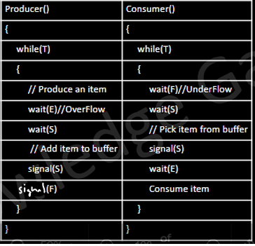
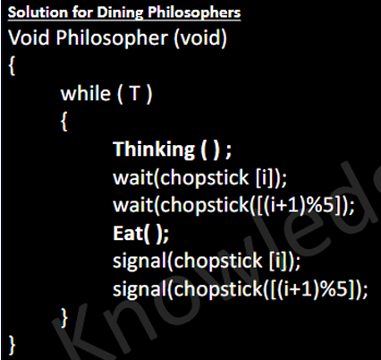
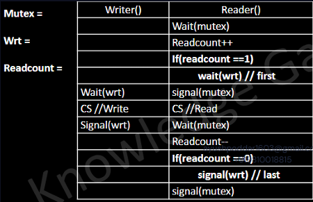

### 
 PRODUCER CONSUMER 
A Producer generates data and places it into a 
buffer.  
A Consumer removes data from the buffer 
and processes it. 
Challenge:  
Producer should not add data into a full 
buffer, and Consumer should not remove 
data from an empty buffer, both shouldn’t 
clash.

### 
 DINING PHILOSOPHER

### 
 READER WRITER 
Multiple readers can read the shared data 
simultaneously without issues. 
But if a writer is writing: 
• No other writer or reader should access 
the data 
Readcount is a variable, rest semaphores

