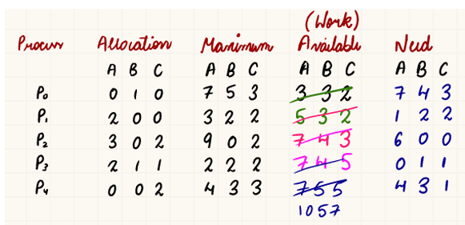
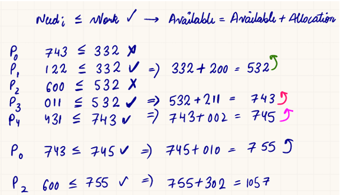
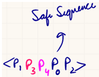
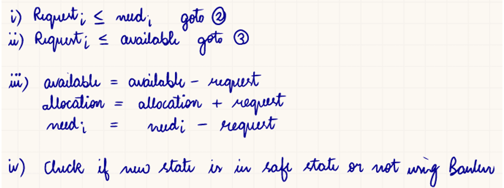
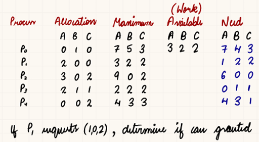
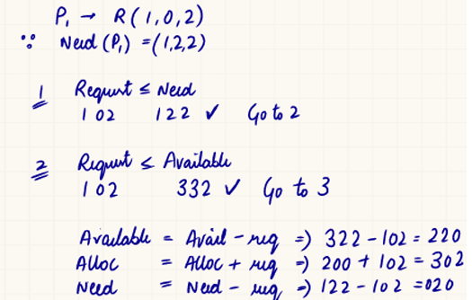
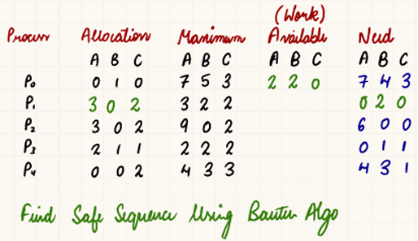

# DEADLOCK
In Multi Programming, several processes may 
compete for finite number of resources. 

If a resource isn’t available, process goes in 
waiting state   
Sometimes state is never again able to change as 
resources it requested are held by other process 
leading to Infinite Starvation  

***State where two or more processes are unable to 
proceed because each is waiting for a resource 
that the other is holding.*** 

## DEADLOCK NECESSARY  (COFFMAN) CONDITIONS
1. **Mutual Exclusion**  
At least one non sharable **resource**.  
(only one process can use that resource at a time) 

2. **Hold and wait**  
A process holding at least one resource is waiting 
to acquire additional resources

3. **No Premption**  
Resources cannot be forcibly taken away from a 
process.

4. **Circular Wait**  
A set of processes are waiting in a circular chain, 
each holding a resource and waiting for another. 

---

## DEADLOCK HANDLING
1. Prevention : Break one of necessary conditions
2. Avoidance : Banker's Algorithm + Resource Request Algorithm
3. Detection and Recovery
4. Ignorance

---

### 
 1. Prevention - 
- Mutual Exclusion : Use only sharable resources 
(rare), Not always possible.
- Hold and Wait : Make processes request all 
resources at once  
- No Premption : If a process requests a 
resource not available, preempt all it holds. 
- Circular Wait : force processes to request in ascending order. 
each process Pi must hold a resource with a higher order than the resource it is waiting for from the next process Pi+1. 

### 
 2. Avoidance -
---
#### BANKER'S ALGORITHM
Developed by Edsger Dijkstra  
Grant a resource only if it won’t lead to a deadlock.

---

| Matrix      | Meaning                                                                                    |
| -------------------- | ------------------------------------------------------------------------------------------ |
| **Allocation** |Currently allocated instances of `Rj` to `Pi`                         |
| **Max**        | Maximum demand of process `Pi` for resource `Rj`                             |
| **Available**  | Number of available instances of resource `Rj`                            |
| **Need\[n×m]**       | `Need = Max - Allocation`  |

---

1. Calculate Need for each process
2. Use formula to find Work, initally work given
   

#### 
 RESOURCE REQUEST ALGORITHM

UPDATE TABLE

