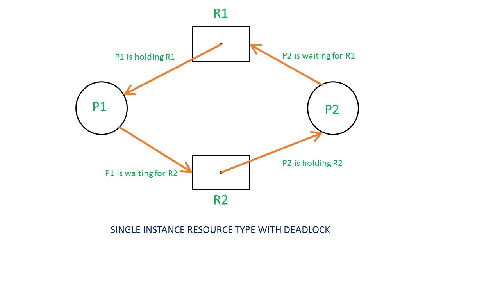
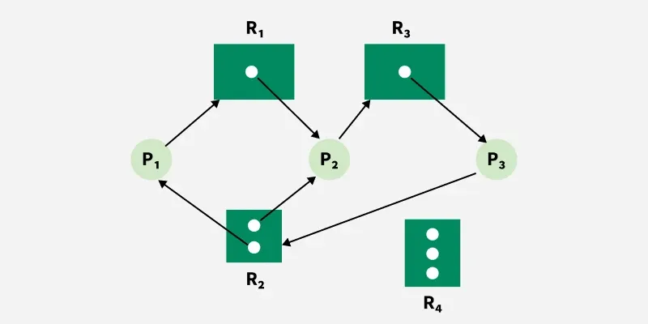

# RESOURCE ALLOCATION GRAPH

It is a graphical representation used to model resource allocation and detect deadlocks in a system.

**Components of RAC:**
1. rocesses – represented by circles (P1, P2, …) 
2. Resources – represented by rectangles (R1, R2, …)
3. Edges:
    - Request edge (P → R): 
    Process is requesting a resource
    - Assignment edge (R → P): 
    Resource is assigned to a process

---
**RAC and Deadlock Detection:**
1. Case 1: No cycle in graph → No deadlock
2. Case 2: Cycle exists
    - If only one instance per resource → Deadlock exists
    - 
    - If multiple instances per resource → Cycle MAY or MAY NOT be deadlock
    - 