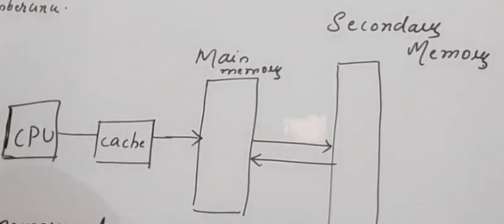
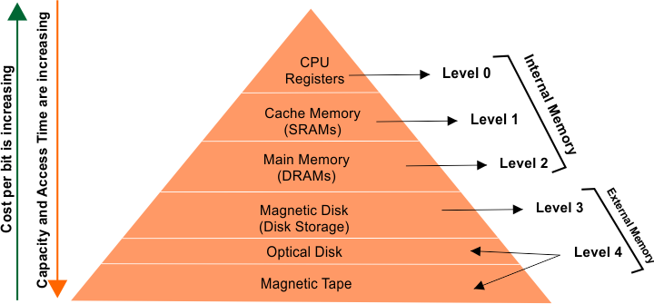

# MEMORY MANAGEMENT

**MEMORY ?**  
To run a process we need primary memory why?  
As secondary memory is huge, making access time huge.
Hence we need RAM i.e. Main memory

Same is case with Cache, Smaller that RAM

---

OS RESPONSIBILITIES WITH MM
1. **ADDRESS TRANSLATION**   
Converts logical(For secondary memory) to physical Address(For primary memory)
2. **MEMORY ALLOCATION & DEALLOCATION**  
Which process to load and remove from memory
3. **MEMORY TRACKING**
4. **MEMORY PROTECTION**