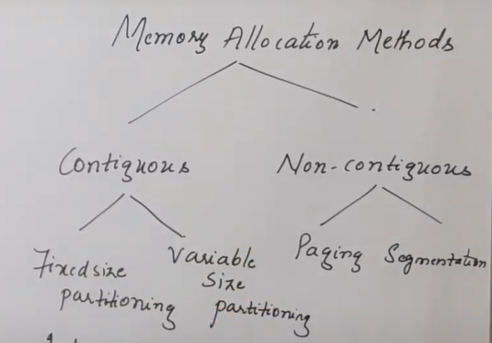
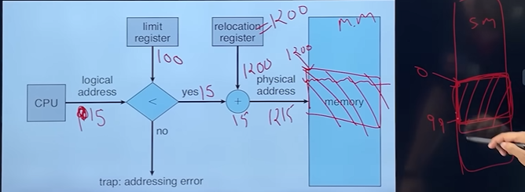
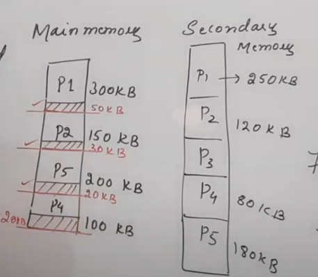
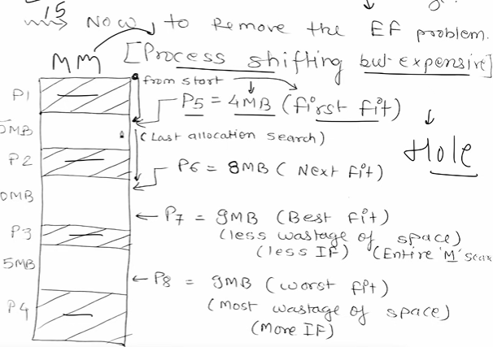
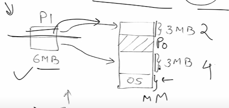

# MEMORY ALLOCATION

## 1. CONTIGUOUS ALLOCATION
### ADDRESS TRANSLATION -

Physical Address(On main memory) = Base Address + Logical Address(Provided by CPU)

---
### PARTIONING -
#### 1. FIXED SIZE PARTIONING -    
- Fixed no. of partitions, Size may vary
- No spanning (half in one half in other)
- High Memory Wastage ie INTERNAL FRAGMENTATION  
Memory that is internal to a partition but is not being used

- External Fragmentation can exist too, Has space but not contiguos

---
#### 2. VARIABLE SIZE PARTIONING -
- Dynamic
- No internal BUT External fragmentation exists
- No effect on degree of multiprogramming

We can remove EF but expensive as we need to shift process  
Here we have - 

First Fit, Next Fit, Best Fit, Worst Fit

## 2. NON CONTIGUOUS ALLOCATION
Spanning is allowed
