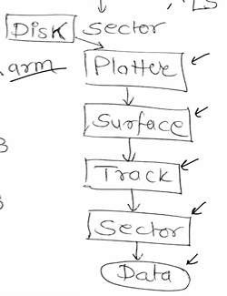

# DISK ARCHITECTURE

1. **SEEK TIME**  
Time required for head to move to targeted **track**  
`ST = N*S`  
//No of tracks moved*thier size

2. **ROTATIONAL LATENCY**  
Time required for head to move to targeted **sector**    
`RL = A/F`  
//Angle b/w current & target/Rotational Frequency

3. **TRANSFER TIME**  
Time taken to transfer the **data**   
`TT = B/R`   
//Size of data in Bytes/Data transfer rate