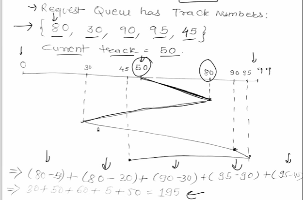
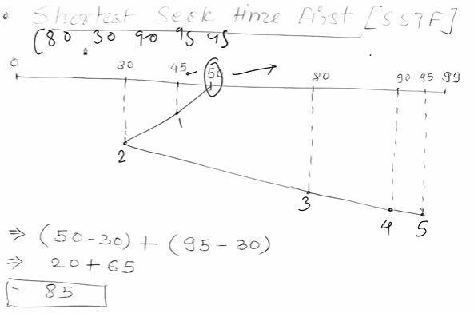
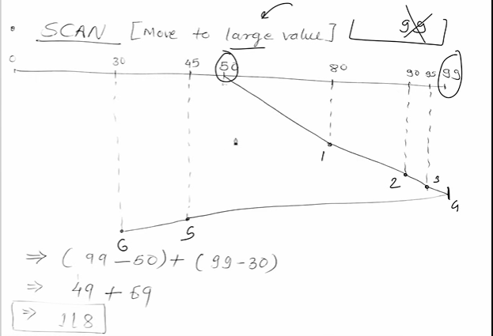
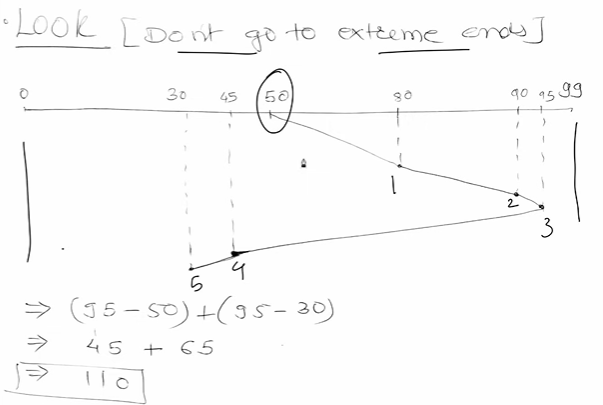
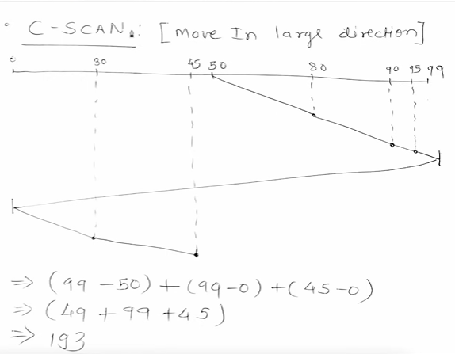
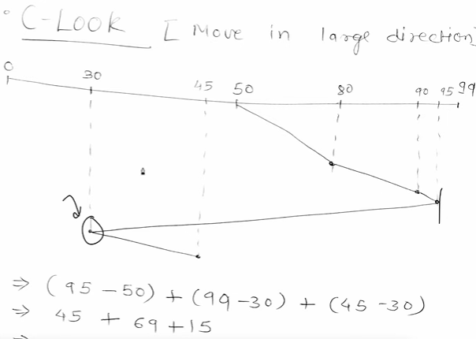

# DSA
To minimize Seek Time

| Algorithm  | Description                                                              |
| ---------- | ------------------------------------------------------------------------ |
| **FCFS**   | First-Come-First-Serve (simple but inefficient)                          |
| **SSTF**   | Shortest Seek Time First (closest request first)                         |
| **SCAN**   | Disk arm moves in one direction and serves requests like an elevator     |
| **LOOK**   | Like SCAN, but reverses direction after last request, not end of disk    |
| **C-SCAN** | Circular SCAN – serves in one direction and goes to beginning after last |
| **C-LOOK** | Like C-SCAN, but only goes up to the last request before wrapping around |

---
1. FCFS

2. SSTF : Shortest Seek Time First

3. SCAN

4. LOOK

5. C-SCAN

6. C-LOOK
